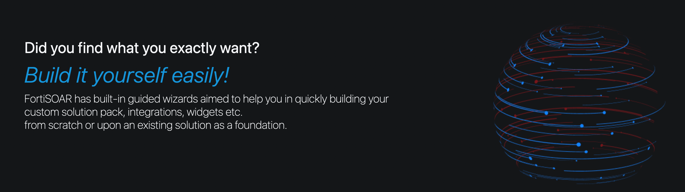

# FortiSOAR Usecase Playbooks Library

Welcome to the FortiSOAR usecase playbook library! Here, we provide a variety of examples to demonstrate different SOC usecases. These workflows can be used to automate your day to to day tasks and also accomplish different security tasks within FortiSOAR. Our examples showcase how specific playboks can be utilized to perform a range of tasks. This space is designed for collaboration, where cybersecurity experts can learn from the examples and contribute their expertise.

We have organized our examples into the following categories:

- [Alert Investigation](./docs/alert-investigation.md)
- [Incident Investigation](./docs/incident-investigation.md)
- [Playbook Generation](./docs/playbook-generation.md)
- [Case Management](./docs/case-management.md)
- [Threat Intelligence](./docs/threat-intelligence.md)
  

[Visit our GitHub page for more details](https://github.com/fortinet-fortisoar/how-tos) 

**Disclaimer**: These are sample prompts and are subject to change
***
